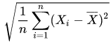

# Projeto 3: Analisador de ativo financeiro

O projeto 3 tem por objetivo desenvolver um programa que analise ativos financeiros da [Bolsa de Valores de São Paulo](http://www.b3.com.br/pt_br/), para identificar os ativos com melhor razão entre retorno e risco. Mais especificamente, o programa deve ser capaz de apresentar:
* Os N ativos com maior retorno financeiro em um determinado período
* Os N ativos com menor volatilidade em um determinado período

A análise deve ser feita com base no [arquivo de dados disponibilizado](http://tele.sj.ifsc.edu.br/~msobral/prg2/2018-2/dados.zip). Esse arquivo de dados possui cotações de ativos entre janeiro de 2007 e setembro de 2018, e suas possuem linhas este formato:

```
mes/ano nome_do_ativo valor_em_R$
```

Ex:

```
01/2007 ALLL3 8.0
01/2007 ALLL4 3.68
```

Seu programa deve receber do usuário estas informações:
* Período de análise, na forma de um mês  e ano inicial, e mês e ano final (ex: 01/2018 a 08/2018)
* O tipo de análise a ser realizada
* A quantidade de ativos cujos resultados devem ser apresentados (parâmetro N)

Seu programa deve obrigatoriamente usar tabela hash para extrair e organizar os dados durante a análise. Mas você deve perceber que sem a tabela hash a tarefa ficaria mais complicada ...

Seu programa pode ler os arquivos de dados UMA ÚNICA VEZ, independente da quantidade de análises a serem realizadas. Todos os dados necessários devem ser lidos e armazenados de forma conveniente em memória. As análises devem ser efetuads sobre esses dados em memória.

Algumas informações são apresentadas a seguir para esclarecer os elementos da análise a ser realizada.

## Retorno financeiro

O retorno financeiro é definido como a porcentagem que expressa o aumento no valor de um ativo em um determinado período. Por exemplo, se em 1/1/2018 um ativo valia R$ 10,00, e em 1/7/2018 esse mesmo ativo vale R$ 12,10, então o retorno financeiro nesse período foi de 21%. De forma geral, o retorno de um ativo pode ser calculado assim:

Y = (Vf - Vi) / Vi x 100%

... sendo Y o retorno financeiro, Vf o valor no final do período analisado e Vi o valor no início desse período.

## Volatilidade

A volatilidade é calculada como o [desvio padrão](https://pt.wikipedia.org/wiki/Desvio_padr%C3%A3o) das rentabilidades em um determinado período. A rentabilidade é dada pelo retorno financeiro em intervalos definidos (ex: diária, semanal, mensal, anual, ...). Por exemplo, seja a rentabilidade mensal de um certo ativo no ano de 2017:

```
Mês 	Rentabilidade (em %)
Jan 	0.42
Fev 	0.40
Mar 	0.53
Abr 	0.47
Mai 	0.55
Jun 	0.51
Jul 	0.32
Ago 	0.53
Set 	0.60
Out 	0.41
Nov 	0.59
Dez 	0.48
```

O [desvio padrão](https://moodle.sj.ifsc.edu.br/mod/vpl/view.php?id=5604) dessas rentabilidades é calculado usando a fórmula para [desvio padrão populacional](https://pt.wikipedia.org/wiki/Desvio_padr%C3%A3o#Desvio_padr%C3%A3o_populacional), dada por:

s=

... sendo xi um valor do conjunto, a média dos valores desse conjunto, e n o tamanho do conjunto. Para o exemplo, a média é 0.484, e o [desvio padrão](https://moodle.sj.ifsc.edu.br/mod/vpl/view.php?id=5604):

s = 0.08


## Referências
    
* [Estatísticas sobre Tesouro Direto](http://www.tesouro.gov.br/-/balanco-e-estatisticas)
* [Séries históricas de ativos negociados na Bovespa](http://www.b3.com.br/pt_br/market-data-e-indices/servicos-de-dados/market-data/historico/mercado-a-vista/series-historicas/)
* [Informações sobre as cotações históricas na Bovespa](http://www.b3.com.br/pt_br/market-data-e-indices/servicos-de-dados/market-data/historico/mercado-a-vista/cotacoes-historicas/)
